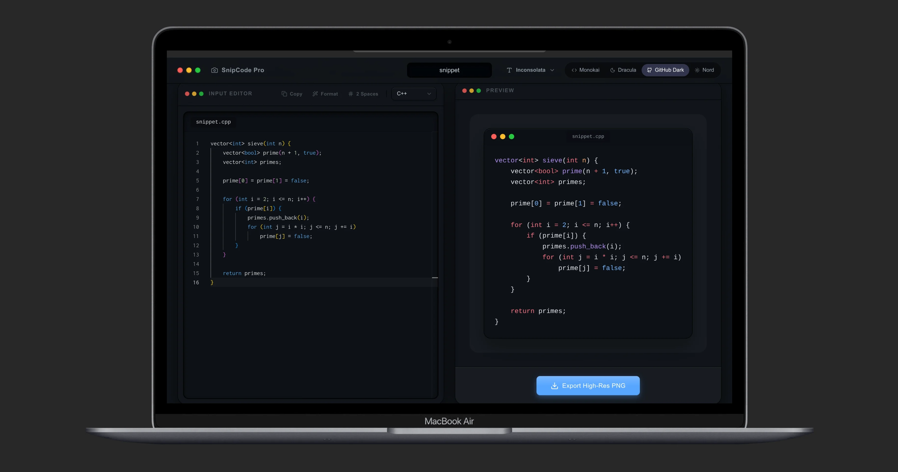

# SnipCode Pro 📷

**Live Demo:** [https://snipcodepro.vercel.app](https://snipcodepro.vercel.app)

SnipCode Pro is a premium, beautifully-designed developer tool that instantly converts your code snippets into stunning, high-resolution PNG images.

Built with a tactile, skeuomorphic design system, it features multi-theme support, smart file name detection, and a fluid drag-and-drop experience. Instead of basic flat design, SnipCode Pro provides real depth, inset shadows, and a macOS-inspired window aesthetic.

---

## ✨ Features

- **Beautiful Skeuomorphic UI** — Realistic depth, layered shadows, and tactile buttons.
- **Multi-Theme Engine** — Switch between Monokai, Dracula, GitHub Dark, and Nord instantly.
- **High-Fidelity Syntax Highlighting** — Powered by `shiki` to perfectly match VS Code textmate grammars.
- **Smart Project Naming** — Set a project name, and watch the file tab and exported PNG name update automatically.
- **Drag & Drop** — Drop any source file onto the code well, and it auto-detects the language.
- **100% Client-Side Export** — Lightning fast, high-res (2x) PNG generation in the browser using `html-to-image`. No backend required.

---

## 🛠 Tech Stack

- **Next.js 15** (App Router)
- **React** & **TypeScript**
- **TailwindCSS v4** (Custom CSS Design tokens)
- **Monaco Editor** (`@monaco-editor/react`)
- **Shiki** (Syntax Highlighting)

---

## 🚀 Quick Start (Local Dev)

1. Clone the repository
2. Install dependencies:
   \`\`\`bash
   pnpm install
   \`\`\`
3. Start the development server:
   \`\`\`bash
   pnpm dev
   \`\`\`
4. Open [http://localhost:3000](http://localhost:3000)

---

## 🐳 Docker Deployment

SnipCode Pro includes a multi-stage Dockerfile and Docker Compose setup for optimized, standalone production deployment.

\`\`\`bash

# Build and run with Docker Compose

docker compose up --build -d

# Visit: http://localhost:3000

\`\`\`

---

## 🎨 Theming System

The app relies on a dynamic global CSS variable system (`globals.css`). It modifies root vars based on the `[data-theme="..."]` attribute:

- \`--bg-body\`: Main ambient background
- \`--surface-raised\`: Gradients for floating panels
- \`--shadow-inset\`: For the editor "screen" depth
- \`--accent\`: Vibrant glow effects for the active theme

---

_Designed & built for developers who care about aesthetics._
